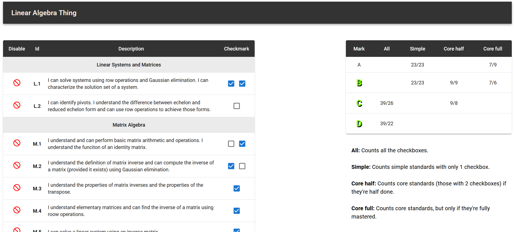

# Linear Algebra Grade Calculator

This is a web application made to automatically calculate grades, given a rather unusual, overcomplicated, marking scheme. To see it in action check out the [live demo](https://linalg-grade-calculator.onrender.com/).

## Technologies

The web app was built using 
- `react` - frontend framework, quick to use, ideal for random side-project like this one
- `material ui` - ui design, decent look and accessibility without much effort

## Future plans

Currently, the project remains dormant, since there are no linear algbra lessons going on right now. However, in the future, it could evolve into something bigger. Potential features include:
- Customizable marking schemes - the teacher provide their own lessons, their own point margins, etc.
- Student access - the students could have their own profiles and save their progress accross different devices

However, all that is a very big maybe.
